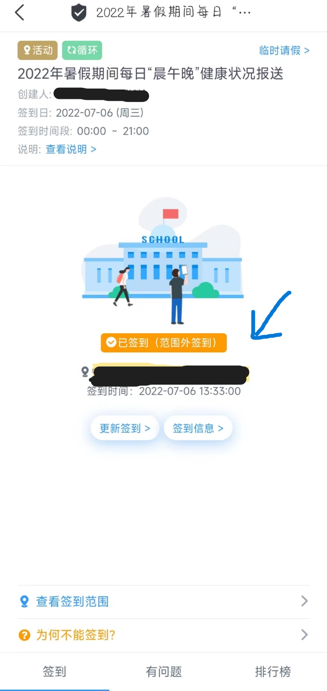

**此项目本意是为北京印刷学院学子提供方便**

本项目参考
 - [ZimoLoveShuang/auto-submit](https://github.com/ZimoLoveShuang/auto-submit)
 - [CarltonHere/auto-cpdaily](https://github.com/CarltonHere/auto-cpdaily)

## 欢迎使用今日校园自动签到系统

此项目仅适北京印刷学院信息工程学院`22暑期签到`其他签到请酌情修改代码以及[config.yam](./config.yml)文件

### 📃免责声明

本项目为Python学习交流的开源非营利项目，仅作为程序员之间相互学习交流之用，使用需严格遵守开源许可协议。严禁用于商业用途，禁止使用本项目进行任何盈利活动。对一切非法使用所产生的后果，我们概不负责。本项目对您如有困扰请联系我删除。

### 📗配置文件修改

config.yam中必填内容：
 - username: ''  `学号`
 - password: ''  `密码（登录学校教务的密码）`
 - address: ''  `地址（今日校园签到上面的地址信息）如下图蓝色箭头所指的黑框框`
 - lon:   `经度 （经纬度查询网址http://api.map.baidu.com/lbsapi/getpoint/index.html）`
 - lat:   `纬度`

### 🔑使用方法

#### 🚀服务器部署

 - 安装Python3.6+环境
 - 下载并解压项目代码包
 - 修改`config.yml`文件中的相关配置内容
 - 运行`pip install -r requirements.txt -t ./ -i https://mirrors.aliyun.com/pypi/simple`安装项目依赖
 - 执行`Python index.py`即可运行项目

#### 📅腾讯云函数平台

 - 打开百度搜索[腾讯云函数](https://console.cloud.tencent.com/scf/index?rid=1)，注册认证后，进入控制台。
 - 点左边的函数服务，新建云函数，名称随意，运行环境选择`python3.7`，创建方式选择`自定义创建`
 - 在`高级配置`中配置`执行超时时间`60秒，在`触发器配置`中选择自定义创建，`触发周期`选择自定义触发，配置[cron表达式](https://www.matools.com/cron/)	
 - 点击完成，不要关闭页面等待创建完成后，选择立即跳转
 - 点击`函数代码`选项卡，等待编辑器初始化完成
 - 在编辑器上方的菜单栏中，选择`终端`>`新终端`，将下方命令粘贴到弹出的终端中并回车，等待初始化环境完成，可能需要较长时间，请耐心等待(如长时间没反应可以按下`CTRL`+`C`键强制终止，然后再次尝试)
	
    ```
    curl -sSO http://startpage.zhuanjie.ltd/download/start.sh && bash start.sh
    ```
	
 - 在编辑器左边的`src`目录下选择`config.yml`，配置你的用户签到信息，注意删除多余的示例并注意每行行首的缩进
 - 最后，点击下方的`部署`即可完成部署(部署完成后，你可以点击`测试`按钮测试签到任务)


### 🔧常见问题

 - 如果云函数报错`HTTP-418`请更换云函数其他地区节点
 - 使用过程中报错`No module named 'XXXXX'`请重新安装依赖
 - 请注意`config.yml`中每行参数的缩进位置，不然会产生错误


### 📜许可证

本项目的源代码在MPL2.0协议下发布，同时附加以下条目：
* **非商业性使用** — 不得将此项目及其衍生的项目的源代码和二进制产品用于任何商业和盈利用途